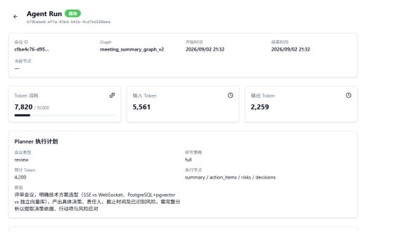
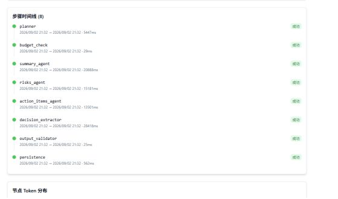
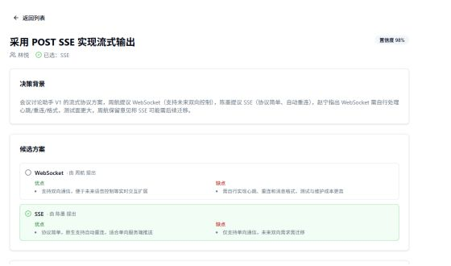

# DeciMeet · 多 Agent 会议决策工作台

DeciMeet 将会议录音转写为可追踪的结构化信息：会议纪要、行动项、风险、候选方案、最终决策与原文证据。系统使用受约束的 LangGraph Workflow 编排多个专业 Agent，并提供决策档案、运行时间线和带来源的 RAG 问答。

DeciMeet 是 **workflow-first 的 Agentic Application**。Planner 可以在预定义节点中选择执行计划，但节点边界、汇合、重试和终止条件均由图控制；当前实现不是能够任意选取工具或无限循环的自治 Agent。

## 核心能力

- 录音上传与异步转写，支持稳定的本地 Mock 和可选的 DashScope Paraformer ASR。
- Planner 驱动的动态多 Agent 分析，按会议特征选择纪要、行动项、风险与决策节点。
- `DecisionDetector → OptionExtractor` 两阶段决策抽取，保留候选方案、取舍理由、反对意见、决策人和原文证据。
- PostgreSQL + pgvector 决策档案与文档知识库。
- 向量检索、PostgreSQL 全文检索、RRF、轻量关键词重排和相似分片去重。
- POST SSE 流式问答与来源展示。
- AgentRun 执行计划、节点状态、耗时、Token 和错误时间线。
- React 多页面工作台、动态高度虚拟列表和活动任务终态轮询。

## 界面预览

| Planner 与运行指标 | 多 Agent 节点时间线 |
|---|---|
|  |  |



## 系统架构

```text
Browser · React 19 / TypeScript
  │
  ├─ 上传录音 ──> FastAPI ──> Transcription Provider
  │                              ├─ mock：本地可重复演示
  │                              └─ dashscope：OSS 临时中转 + Paraformer ASR
  │                                      └─ finally 清理 OSS 临时对象
  │
  ├─ 生成会议分析 ──> SummaryService ──> AgentRun
  │                                         │
  │                                      LangGraph
  │                                         │
  │                                      Planner
  │                                         │
  │                                   BudgetCheck
  │                                         │ dynamic fan-out
  │                    ┌────────────────────┼────────────────────┐
  │                    │                    │                    │
  │                 Summary           Action Items            Risks
  │                    │                    │                    │
  │                    └──────────── Decision Pipeline ─────────┘
  │                                  Detector → Extractor
  │                                         │
  │                                  Output Validator
  │                                  ├─ 定向回灌重试
  │                                  └─ 达到上限后显式失败
  │                                         │
  │                              SummaryService 事务落库
  │                                         │
  │                           PostgreSQL + pgvector
  │
  └─ RAG 问答 ──> 条件式查询改写 ──> 文档检索路 + 决策检索路
                                              │
                                         异构结果合并
                                              │
                                      Qwen POST SSE + sources
```

一次会议分析请求依次经历：读取按 `seq_index` 排序的转写、创建 AgentRun、Planner 生成计划、可选长文本压缩、专业节点 fan-out、结构校验与定向重试、事务写入纪要和结构化结果、更新 AgentRun 终态、将成功纪要索引到知识库。

## Agent Workflow

### 受约束的动态规划

Planner 只决定是否运行以下预定义节点：

- `summary_agent`
- `action_items_agent`
- `risks_agent`
- `decision_extractor`

Planner 不能生成任意节点名。图负责并行调度、结果汇合、最多两次的定向重试和结束条件。Planner 失败时会回退到规则计划；长文本压缩失败时会回退原文。

### 结构化输出与恢复

- JSON 解析失败与合法空数组严格区分。
- Validator 将具体失败原因通过 `retry_reason` 回灌给对应节点。
- 每个并行节点使用独立的可恢复错误槽；重试成功会清除中间错误。
- 只有重试耗尽或不可恢复错误才进入终态 `errors`。
- 节点包含超时、熔断、Token 预算和步骤记录。
- Token 分别记录 input、output 与 total；当前没有可信且带版本的 USD 价格表，因此不估算模型成本。

### 两阶段决策抽取

```text
多人会议转写
  ↓
DecisionDetector
  ├─ decision：已经拍板
  ├─ proposal：只有提议
  └─ deferred：明确推迟
  ↓ 仅保留高置信度的已拍板片段
OptionExtractor
  ↓
title / context / options / chosen / reasons /
objections / decided_by / snippet / confidence
  ↓
Decision + DecisionOption + DecisionRelation
```

`chosen` 必须对应某个候选方案名称，否则该段视为结构化失败。Detector 的原文片段、置信度和判定类型会随 Workflow 结果保留，便于持久化和人工核查。单个片段失败不会丢弃其他成功片段；全部片段失败时进入定向重试。

## RAG 实现与边界

### 文档检索路

1. 解析 PDF、DOCX、TXT 和 Markdown。
2. 使用 `RecursiveCharacterTextSplitter` 按 1000 字符、200 overlap 分块。
3. 使用 Qwen `text-embedding-v3` 生成 1024 维向量并写入 pgvector。
4. 并行执行向量余弦召回与 PostgreSQL `tsvector / ts_rank` 全文召回。
5. 对同一文档集合的两路排名执行 RRF 融合。
6. 使用中英文词项命中进行轻量 rerank。
7. 在截取 top-k 前去除高度相似的 overlap 分片，避免重复上下文占满窗口。

### 决策检索路

决策标题与背景单独向量化，并从 `decisions` 表执行语义检索。文档检索路和决策检索路属于不同语料与分数空间，因此跨路合并不是再次执行 RRF：系统先在各路内部归一化相关度，再结合查询中的决策意图做轻量加权。

### 多轮查询改写

仅当存在历史消息，且当前问题较短并带有“它”“这个”“that”“it”等指代表达时调用模型改写。改写失败、为空或异常时回退原查询，避免每轮无条件增加模型调用。

### 已知检索限制

- PostgreSQL `simple` 全文配置没有专业中文分词；中文语义召回主要依赖 Embedding，ILIKE 与中文 bigram rerank 仅作为补充。
- 当前轻量 rerank 不是 Cross-Encoder 或专用 Reranker。
- 当前没有固定离线评测集，尚未形成 Recall@K、MRR、引用命中率或准确率结论。

## 数据一致性与可靠性

- AgentRun 的 JSONB 步骤时间线使用行锁更新，避免并行节点覆盖彼此结果。
- 同一进程内按 meeting 加锁，并通过数据库唯一约束限制重复纪要和重复转写序号。
- ASR 使用上传文件路径作为 generation token，避免旧后台任务覆盖新上传音频的结果。
- `dashscope` 模式失败会显式进入失败状态；`auto` 模式才允许降级到 Mock。
- 纪要、行动项和风险作为核心快照提交；决策持久化失败不会让已生成纪要不可读，但 AgentRun 会保留失败状态。
- OSS 临时对象在成功或失败后都通过 `finally` 清理。

## Web 工作台

| 路由 | 能力 |
|---|---|
| `/` | 创建会议、上传录音、查看处理状态 |
| `/meetings/:id` | 转写虚拟列表、Mock/真实 ASR 标识、会议决策 |
| `/summaries/:id` | 触发 Workflow，查看 Markdown 纪要、行动项和风险 |
| `/agent-runs` | 运行统计、状态过滤、活动任务轮询 |
| `/agent-runs/:id` | Planner 计划、节点时间线、耗时、Token 与错误 |
| `/decisions` | 决策列表与语义搜索 |
| `/decisions/:id` | 候选方案、理由、反对意见、原文证据与关联决策 |
| `/knowledge` | 文档上传、混合检索与来源定位 |
| `/chat` | RAG 问答、POST SSE 增量渲染、来源展示与虚拟列表 |

聊天列表仅在用户位于底部附近时自动跟随流式内容；用户向上阅读历史消息时不会被强制拉回底部。

## 技术栈

| 层次 | 技术 |
|---|---|
| Web | React 19、TypeScript、Vite、TanStack Query、TanStack Virtual、Zustand、React Markdown |
| API | FastAPI、Pydantic、SQLAlchemy Async、Alembic |
| Agent | LangGraph、LangChain、Qwen OpenAI-compatible API |
| 数据 | PostgreSQL 16、pgvector、JSONB、PostgreSQL FTS |
| ASR | DashScope Paraformer、OSS；本地 Mock Provider |
| 基础设施 | Docker Compose、GitHub Actions |

## 本地启动

### 环境要求

- Python 3.11+
- Node.js 20.19+ 或 22.12+
- Docker 与 Docker Compose
- 可用的 DashScope / Qwen API Key，用于 Agent、Embedding 和问答

### 1. 启动 PostgreSQL + pgvector

```bash
docker compose up -d
```

数据库默认映射到宿主机 `5434`。

### 2. 启动后端

macOS / Linux：

```bash
cd backend
python -m venv .venv
source .venv/bin/activate
python -m pip install -r requirements-dev.txt
cp .env.example .env
# 编辑 .env，至少填写 OPENAI_API_KEY
python -m alembic upgrade head
python -m uvicorn app.main:app --reload --port 8787
```

PowerShell：

```powershell
cd backend
python -m venv .venv
.\.venv\Scripts\Activate.ps1
python -m pip install -r requirements-dev.txt
Copy-Item .env.example .env
# 编辑 .env，至少填写 OPENAI_API_KEY
python -m alembic upgrade head
python -m uvicorn app.main:app --reload --port 8787
```

### 3. 启动前端

```bash
cd frontend
npm ci
npm run dev
```

- Web：<http://localhost:5173>
- OpenAPI：<http://localhost:8787/docs>
- Health：<http://localhost:8787/api/health>

## 演示路径

1. 保持 `.env` 中 `TRANSCRIPTION_PROVIDER=mock`。
2. 创建一场“DeciMeet 架构评审会”，上传任意受支持的小型音频文件。
3. 等待会议进入 `processed`；页面会明确标注当前使用模拟转写。
4. 进入纪要页触发生成，并在 `/agent-runs` 查看 Planner、fan-out、校验、重试与持久化时间线。
5. 查看纪要、行动项、风险和决策详情中的候选方案、反对意见与原文证据。
6. 在 `/chat` 提问“为什么选择 POST SSE？”或“为什么使用 PostgreSQL + pgvector？”，检查流式回答和来源。

Mock 只替代 ASR 输出，不替代 LangGraph、Qwen Agent、Embedding、数据库或前端运行链路。

### 可选：真实 ASR

```dotenv
TRANSCRIPTION_PROVIDER=dashscope
DASHSCOPE_API_KEY=...
OSS_ACCESS_KEY_ID=...
OSS_ACCESS_KEY_SECRET=...
OSS_ENDPOINT=https://oss-cn-hangzhou.aliyuncs.com
OSS_BUCKET_NAME=...
OSS_PREFIX=audio/
```

真实链路为：本地文件 → OSS 临时对象 → DashScope 异步 ASR → 轮询结果 → 规范化转写片段 → 事务替换转写快照 → 清理 OSS 对象。

## 测试与质量检查

后端：

```bash
cd backend
python -m pip install -r requirements-dev.txt
python -m pytest -q
python -m alembic heads
```

前端：

```bash
cd frontend
npm ci
npm run lint
npm run build
```

相同检查会在 GitHub Actions 的 push 与 pull request 上运行。

## 当前未实现

- Tool Calling、Function Calling 和 MCP
- LangGraph checkpoint resume 与完整 Human-in-the-loop 状态机
- 登录、RBAC 和租户隔离
- Redis、Celery、Kafka、Kubernetes 与微服务拆分
- 跨进程 meeting 分布式锁
- 专用中文分词、Cross-Encoder Reranker 和离线 RAG 评测集
- 生产用户量、QPS、SLA 或准确率基准

## 维护者

[ZC-peng](https://github.com/ZC-peng)
